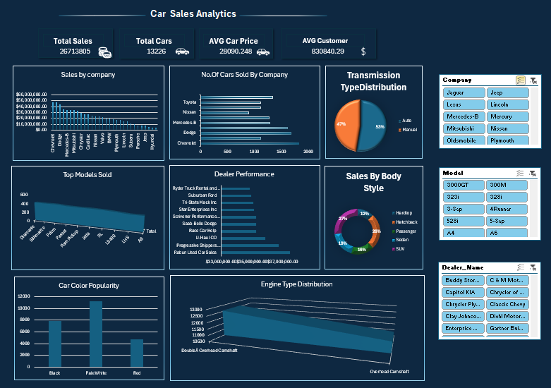

# 🚗 Car Sales Analytics - Excel Dashboard

## 📌 Project Overview
This interactive Excel dashboard analyzes car sales performance across different companies, models, body styles, transmission types, and engine types.

## 📊 Key Metrics (KPIs)
- **Total Sales:** $267,138,050
- **Total Cars Sold:** 13,226 units
- **Average Car Price:** $28,090
- **Average Customer Income:** $830,840

## 🛠️ Features & Tools Used
- **Microsoft Excel:** Pivot Tables, Advanced Formulas, Interactive Slicers.
- **Data Visualization:** Bar Charts, Donut Charts, 3D Surface Charts, Custom Dark Theme.
- **Interactivity:** Filter sales dynamically by Company, Model, and Dealer.

## 📁 Repository Structure
- `Car_Sales_Dashboard.xlsx` - Full interactive Excel file.
- `car_sales_data.csv` - Raw dataset used for analysis.
- `dashboard_preview.png` - Dashboard overview screenshot.
